<br>

# PRODUCT WITH COUPONS MICRO-SERVICES 

<br>
<br>
<br>


<br>
<br>

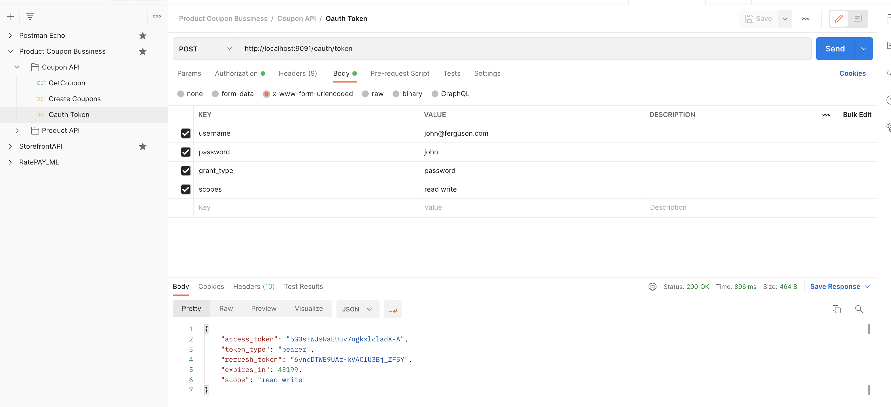

<br>
<br>

<br>
<br>

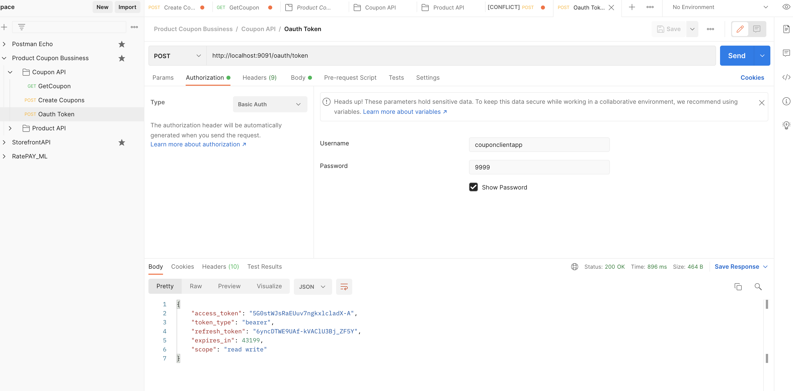

<br>
<br>

<br>
<br>

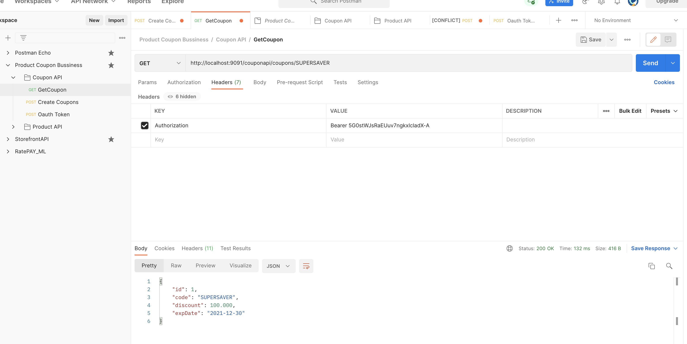

<br>
<br>


<br>
<br>


<br>
<br>


<br>
<br>

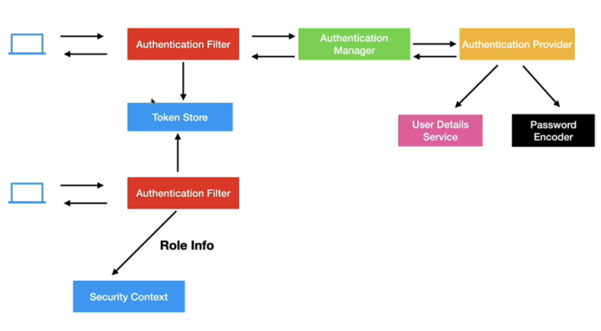

<br>
<br>


<br>
<br>

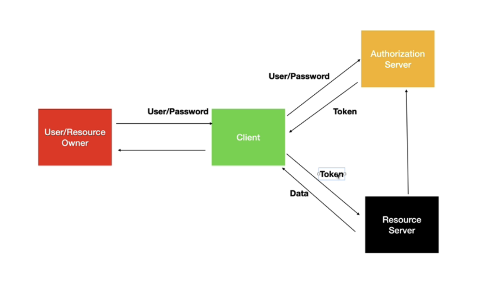

<br>
<br>


<br>
<br>

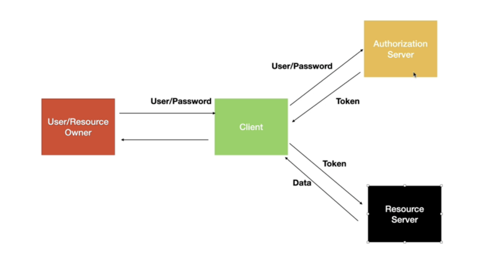

<br>
<br>

<br>
<br>

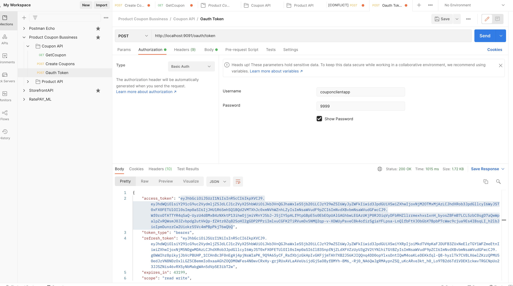

<br>
<br>


<br>
<br>

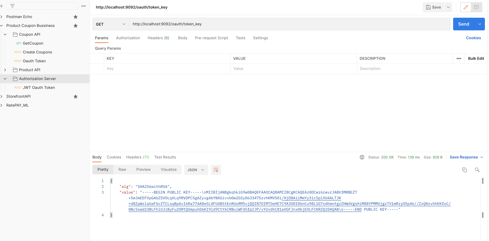

<br>
<br>


## AUTHORIZATION CODE GRANT TYPE

<br>
<br>

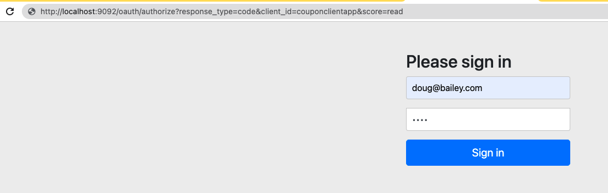

<br>
<br>


<br>
<br>

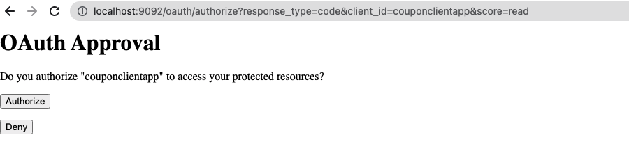

<br>
<br>


<br>
<br>

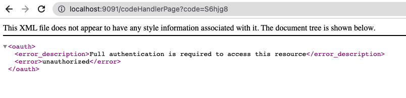

<br>
<br>


<br>
<br>

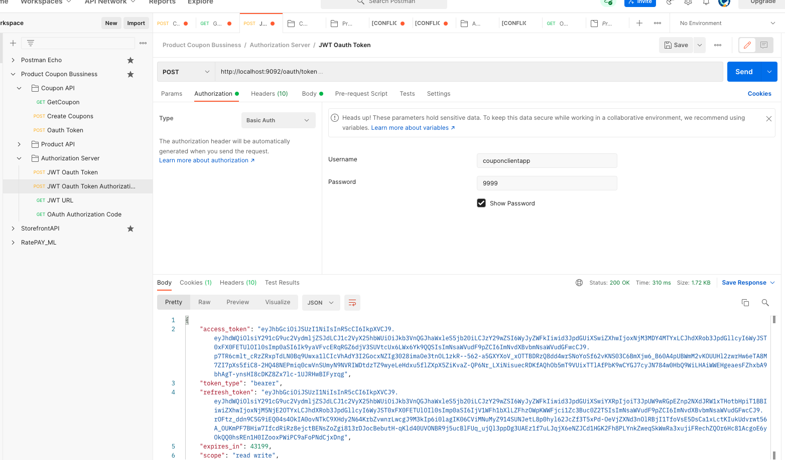

<br>
<br>


<br>
<br>

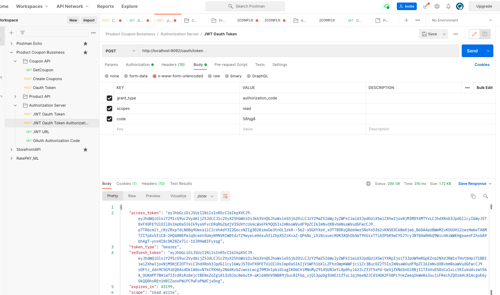

<br>
<br>


```
    keytool -genkeypair -alias jwtiscool -keyalg RSA -keypass jwtiscool -keystore jwtiscool.jks -storepass jwtiscool

    keytool -list -rfc --keystore jwtiscool.jks | openssl x509 -inform pem -pubkey
```