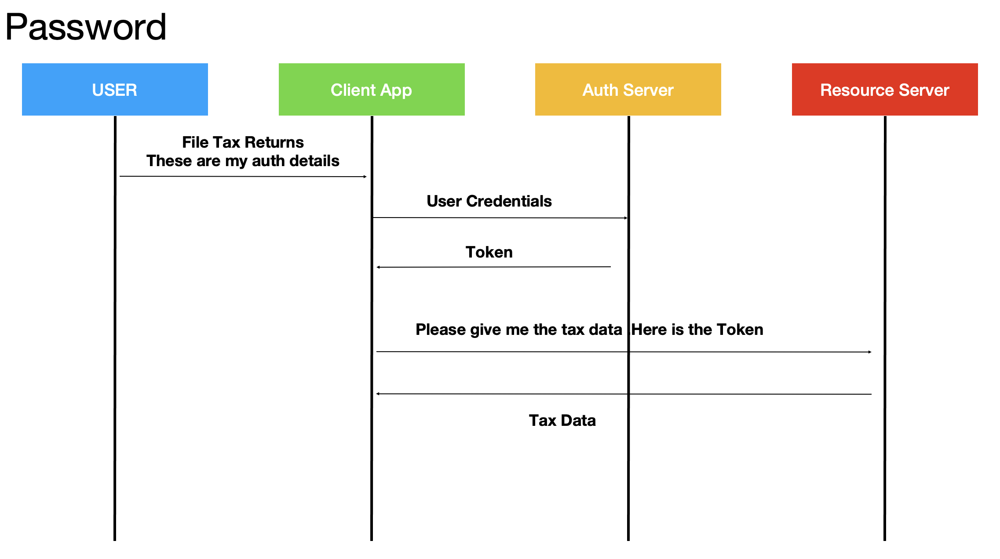
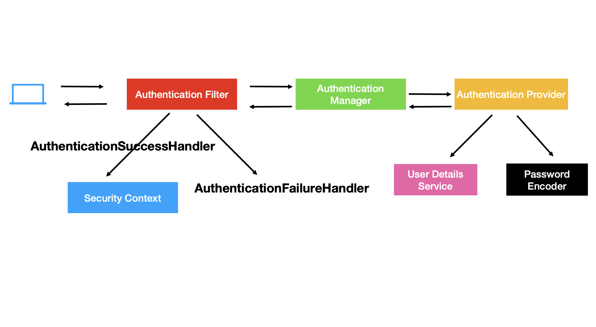
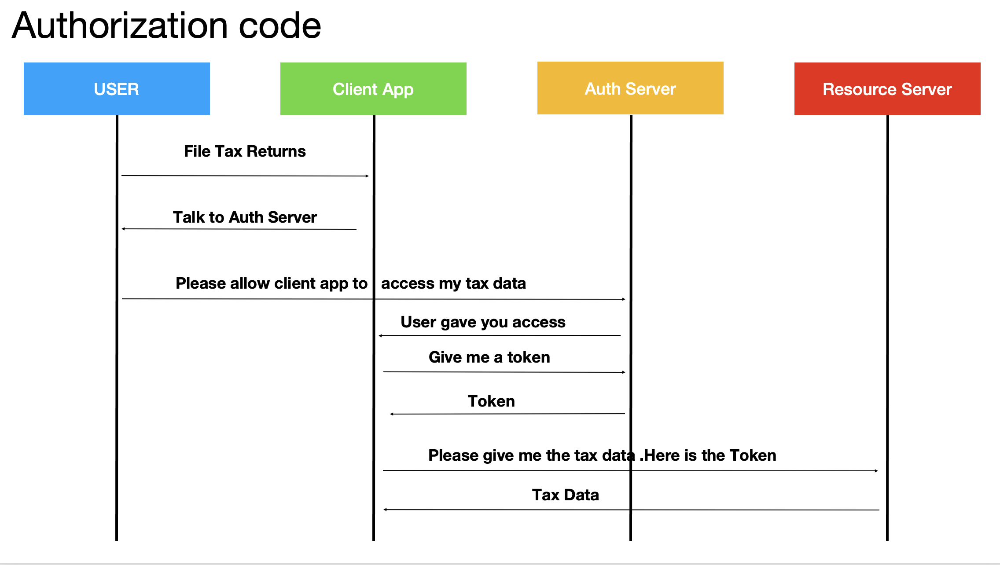
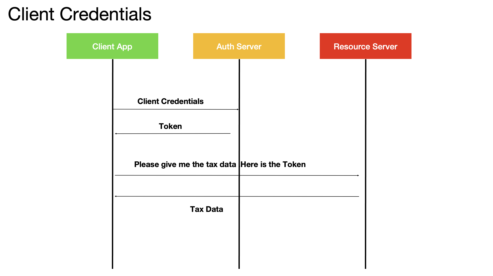
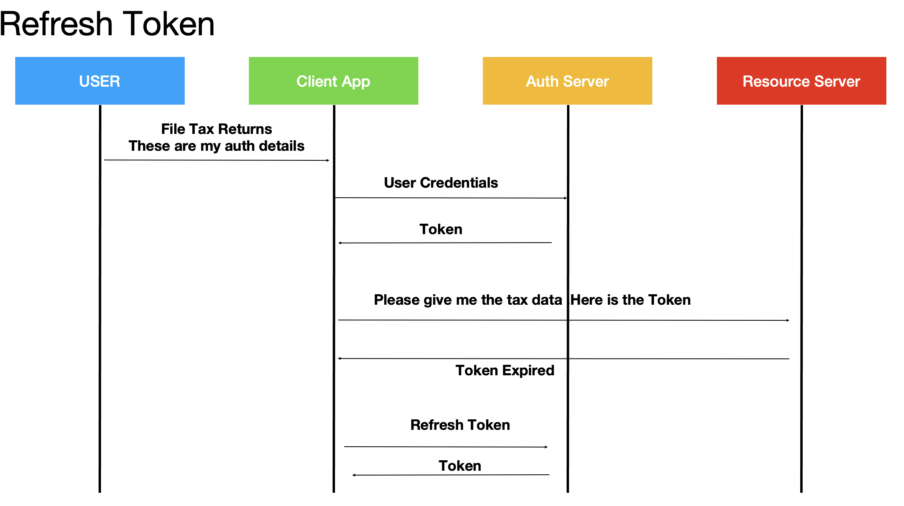

<br>

# PRODUCT WITH COUPONS MICRO-SERVICES 

<br>

## KEY SECURITY CONCEPTS 

<br>
<br>

## Authetication

<br>

This is the process to know the application who we are. usually, we do authetication using the username and password and the application let us access inside.

<br>

## Authorization

Once the user login to the application, authorization determine how much (i.e. functionalities) the user will have the acces to the app and what they would be allowed to perform. 


<br>

## Confidentiality

This ensures that the data being used is not breached by the hacker and we use encryption/ decryption to ensure the data confidentiality. 

<br>

## Integrity

This ensures that the data is not changed during the process of communication. We use signatures for ensuring the data integrity. 

<br>


## CSRF

This prevents another website to submit the data on our behalf. 

<br>

## CORS

This ensures that the application in different domains can communicate with each other without an issue.

<br>


<br>
<br>



<br>
<br>

<br>
<br>



<br>
<br>

<br>
<br>



<br>
<br>

<br>
<br>



<br>
<br>

<br>
<br>



<br>
<br>

<br>
<br>
<br>


<br>
<br>


<br>
<br>

<br>
<br>


<br>
<br>

<br>
<br>


<br>
<br>


<br>
<br>


<br>
<br>


<br>
<br>


<br>
<br>


<br>
<br>


<br>
<br>


<br>
<br>


<br>
<br>

<br>
<br>


<br>
<br>


<br>
<br>


<br>
<br>


## AUTHORIZATION CODE GRANT TYPE

<br>
<br>


<br>
<br>


<br>
<br>


<br>
<br>


<br>
<br>


<br>
<br>


<br>
<br>


<br>
<br>


<br>
<br>


<br>
<br>


## REATE THE PRIVATE  AND PUBLIC KEY

```
    keytool -genkeypair -alias jwtiscool -keyalg RSA -keypass jwtiscool -keystore jwtiscool.jks -storepass jwtiscool

    keytool -list -rfc --keystore jwtiscool.jks | openssl x509 -inform pem -pubkey
```